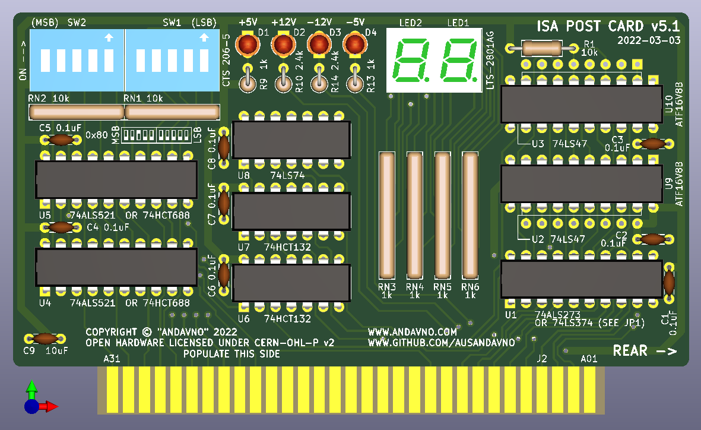
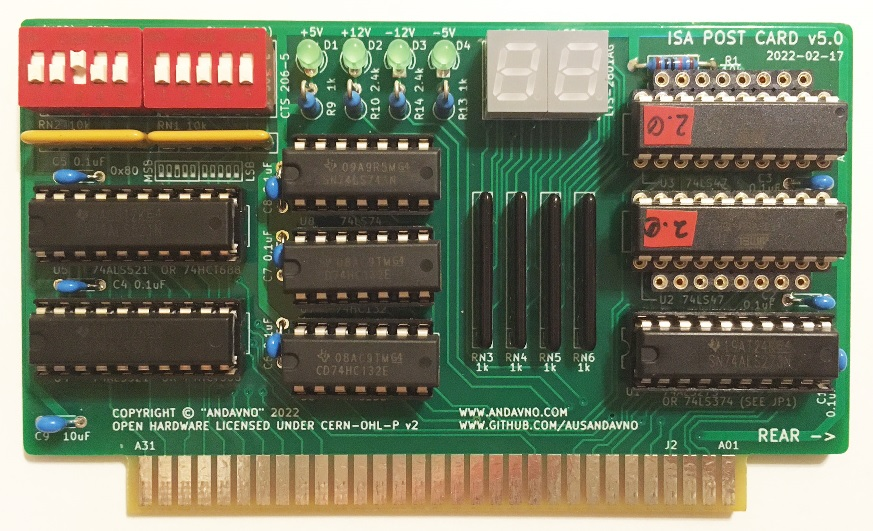

# ISA_POST_Card_v5.1
Version 5.1 of a plug-in diagnostic card that displays Power On Self Test (POST) codes on an 8-bit ISA data bus. Tested for use with Micro8088 and Xi8088 systems. Can be configured to listen on any address in the lower ten bits of address space.

Board render:

Constructed board (ignore version number):

## Hardware Documentation

### Schematic and PCB Layout

[Schematics - Version 5.1 (pdf)](../v5.1/Schematics/ISA_POST_Card_v5.1-Schematic.pdf)

[PCB Layout - Version 5.1 (zip)](../v5.1/PCB_Layout/ISA_POST_Card_v5.1-PCB_Layouts.zip)

[Gerbers - Version 5.1 (zip)](../v5.1/Gerbers/ISA_POST_Card_v5.1-Gerbers.zip)

### Building Instructions

Recommend soldering components in order of height, lowest to highest: Resistors (Rx), IC sockets (if used), Resistor Networks (RNx), Capacitors (Cx), Discrete LEDs (Dx), Seven Segment LEDs (LEDx), Switches (SWx).

Recommend populating turned-pin strip headers for U2, U3, U9 and U10. Populate U2, U3 if intending to use seven-segment display driver 74LS47. Populate U9, U10 if intending to use ATF16V8B-15PU to display hexadecimal values.

### Jumpers, Connectors, and Switches

#### JP1 - Select chip options for U1
Position | Description
-------- | -----------
1-2 closed (default)* | Use 74x273 Series
2-3 closed | Use 74x374 Series

*Cut trace to open 1-2

#### SW1 - Lowest five bits of address space selection
Position	| Description
-------- | -----------
SW1.1 | bit 4 of address space
SW1.2 | bit 3 of address space
SW1.3 | bit 2 of address space
SW1.4 | bit 1 of address space
SW1.5 | bit 0 of address space (LSB)

#### SW2 - Highest five bits of address space selection
Position	| Description
-------- | -----------
SW2.1 | bit 9 of address space (MSB)
SW2.2 | bit 8 of address space
SW2.3 | bit 7 of address space
SW2.4 | bit 6 of address space
SW2.5 | bit 5 of address space

### Bill of Materials - v5.1

Component type     | Reference | Description            | Quantity | Possible sources and notes 
------------------ | --------- | ---------------------- | -------- | --------------------------
PCB                |           | ISA Post Card v5.1     | 1        | Use supplied Gerber or KiCad files to order from your perferred PCB fabrication house
Integrated Circuit | U1        | 74ALS273 or 74ALS374 (See JP1 Setting)   | 1        | Mouser [SN74ALS273N](https://www.mouser.com/ProductDetail/595-SN74ALS273N) or [SN74ALS374AN](https://www.mouser.com/ProductDetail/595-SN74ALS374AN)
Integrated Circuit | U2, U3    | 74LS47 (Alternative to U9, U10)   | 2        | Mouser [SN74LS47NE4](https://www.mouser.com/ProductDetail/595-SN74LS47NE4)
Integrated Circuit | U4, U5    | 74ALS521 or 74HCT688   | 2        | Mouser [SN74ALS521N](https://www.mouser.com/ProductDetail/595-SN74ALS521N) or [CD74HCT688E](https://www.mouser.com/ProductDetail/595-CD74HCT688E)
Integrated Circuit | U6, U7    | 74HCT132                | 2        | Mouser [CD74HCT132E](https://www.mouser.com/ProductDetail/595-CD74HCT132E)
Integrated Circuit | U8        | 74LS74                 | 1        | Mouser [SN74LS74AN](https://www.mouser.com/ProductDetail/595-SN74LS74AN)
Integrated Circuit | U9, U10   | ATF16V8B (Alternative to U2, U3) | 2        | Mouser [ATF16V8B-15PU](https://www.mouser.com/ProductDetail/556-AF16V8B15PU)
LED    | LED1, LED2   | 7-Segment Display W7.4mm H10mm  | 2        | Mouser [LTS-2801AG](https://www.mouser.com/ProductDetail/859-LTS-2801AG) or [LTS-2801AWC](https://www.mouser.com/ProductDetail/859-LTS-2801AWC)
LED | D1 - D4   | LED D3.0mm    | 4        | Mouser [LTL-4231N](https://www.mouser.com/ProductDetail/859-LTL-4231N)
Resistor Network   | RN1, RN2  | R_Array_SIP6 10K (Bussed)      | 2   | Mouser [4606M-101-103LF](https://www.mouser.com/ProductDetail/652-4606M-1LF-10K)
Resistor Network   | RN3 - RN6  | R_Array_SIP8 1K (Isolated)   | 4  |  Mouser [L083S122LF](https://www.mouser.com/ProductDetail/858-L083S122LF)
Resistor   | R1  | R_Axial_DIN0207 L6.3mm D2.5mm P10.16mm 10K       | 1        | Mouser [MFR-25FRF52-10K](https://www.mouser.com/ProductDetail/603-MFR-25FRF5210K)
Resistor   | R9, R13  | R_Axial_DIN0207 L6.3mm D2.5mm P10.16mm 1k | 2 | Mouser [MFR-25FRF52-1K](https://www.mouser.com/ProductDetail/MFR-25FRF52-1K)
Resistor   | R10, R14  | R_Axial_DIN0207 L6.3mm D2.5mm P10.16mm 2.4k | 2 | Mouser [MFR-25FRF52-2K4](https://www.mouser.com/ProductDetail/603-MFR-25FRF52-2K4)
Capacitor   | C1 - C8  | P5.08mm 0.1uF 50V  | 8        | Mouser [FG28X7R1H104KNT06](https://www.mouser.com/ProductDetail/810-FG28X7R1H104KNT6)
Capacitor   | C9  | P5.08mm 10uF 10V  | 1        | Mouser [FG24X7R1A106KRT06](https://www.mouser.com/ProductDetail/810-FG24X7R1A106KRT6)
Switch   | SW1, SW2  | SW_DIP_SPSTx05_Slide 9.78x14.88mm W7.62mm P2.54mm   | 2    | Mouser [CTS 206-5](https://www.mouser.com/ProductDetail/774-2065) or [C&K BD05](https://www.mouser.com/ProductDetail/611-BD05)
Socket   | for U1, U4, U5 | 20 pin 300 mil DIP socket    | 3    | Mouser [4820-3000-CP](https://www.mouser.com/ProductDetail/517-4820-3000-CP)
Socket   | for U6, U7, U8 | 14 pin 300 mil DIP socket    | 3    | Mouser [4814-3000-CP](https://www.mouser.com/ProductDetail/517-4814-3000-CP)
Socket *   | for U9, U10 | 10 WAY SIL VERT SKT           | 4    | Mouser [D01-9971042](https://www.mouser.com/ProductDetail/855-D01-9971042)
Socket *   | for U2, U3 | 8 WAY SIL VERT SKT            | 4    | Mouser [D01-9970842](https://www.mouser.com/ProductDetail/855-D01-9970842)
Socket **   | Alt for U9, U10 | 20 pin 300 mil DIP socket  | 2    | Mouser [4820-3000-CP](https://www.mouser.com/ProductDetail/517-4820-3000-CP)
Socket **   | Alt for U2, U3 | 16 pin 300 mil DIP socket   | 2    | Mouser [4816-3000-CP](https://www.mouser.com/ProductDetail/517-4816-3000-CP)

*Recommended to use SIL Sockets instead of DIP sockets if you want to swap between fitting U2, U3 and U9, U10.

**Use DIP sockets if you are comfortable committing to either U2, U3 or U9, U10. Cannot swap between chip types without removing DIP socket. 

### Alternative ICs

Supply chain distruptions have caused havoc with availability of ICs. Below are some suggestions for alternative types that are likely to work as substitues to those in the BOM. NOTE: not all alternative chip types or combinations of chip types have been tested. Use caution substituting CMOS types for Bipolar types. Bipolar outputs to CMOS inputs may give issues with voltage levels.

* 74ALS273 Alternatives:
  * Mouser [SN74LS273N](https://www.mouser.com/ProductDetail/595-SN74LS273N)
  * Mouser [SN74HCT273N](https://www.mouser.com/ProductDetail/595-SN74HCT273N)
  * Mouser [CD74ACT273E](https://www.mouser.com/ProductDetail/595-CD74ACT273E)

* 74ALS374 Alternatives:
  * Mouser [SN74LS374N](https://www.mouser.com/ProductDetail/595-SN74LS374N)
  * Mouser [SN74F374N](https://www.mouser.com/ProductDetail/595-SN74F374N)
  * Mouser [SN74HCT374N](https://www.mouser.com/ProductDetail/595-SN74HCT374N)
  * Mouser [CD74ACT374E](https://www.mouser.com/ProductDetail/595-CD74ACT374E)

* 74ALS521 Alternatives:
  * Mouser [SN74F521N](https://www.mouser.com/ProductDetail/595-SN74F521N)

* 74HCT688 Alternatives:
  * Mouser [SN74LS688N](https://www.mouser.com/ProductDetail/595-SN74LS688N)
  * Mouser [SN74ALS688N](https://www.mouser.com/ProductDetail/595-SN74ALS688N)

* 74HCT132 Alternatives:
  * Mouser [SN74LS132N](https://www.mouser.com/ProductDetail/595-SN74LS132N)

* 74LS74 Alternatives:
  * Mouser [SN74ALS74AN](https://www.mouser.com/ProductDetail/595-SN74ALS74AN)
  * Mouser [SN74F74N](https://www.mouser.com/ProductDetail/595-SN74F74N)
  * Mouser [CD74HCT74E](https://www.mouser.com/ProductDetail/595-CD74HCT74E)
  * Mouser [CD74ACT74E](https://www.mouser.com/ProductDetail/595-CD74ACT74E)

## Firmware Documentation

### ATF16V8B

The ATF16V8B-15PU chip (U9, U10) can be chosen as a substitute to the 74LS47 (U2, U3). The ATF16V8B chip is primarily used to emulate a 74LS47 seven segment display decoder IC with additional/new hex-output functionality. If one would like to be able to see hexadecimal values on the seven-segment displays of the POST card, then the ATF16V8B should be chosen.

The ATF16V8B must be programmed with a ".jed" file. A copy of this file "HEX_TO_7SEG_DECODER_COM_AN_V2.0.jed" has been placed in the "ATF16V8B_JED" folder.

Refer to my [Hex_To_Seven_Segment_Decoder](https://github.com/ausandavno/Hex_To_Seven_Segment_Decoder/tree/master/COMMON_ANODE_v2.0) repository for associated WinCUPL project files.

Refer to [My website](https://www.andavno.com/?p=672) for an overview of recent changes to the ATF16V8B program.

For some instruction on how to compile the WinCUPL code for the ATF16V8B, please see “How to Compile the Code” section of my post [7 segment display decoder with HEX output](https://www.andavno.com/?p=539).

For some instruction on how to go about programming the ATF16V8B with a TL866II PLUS programmer, please see “Flashing U16” section of my post on [building the Micro 8088](https://www.andavno.com/?p=85).

## Changes
* Version 5.1
  * First Issue

## Known Issues
* Version 5.1
  * None at present
 
## Open Hardware License
 
You may redistribute and modify this Covered Source, and make products using it, under the terms of the CERN-OHL-P v2 (https:/cern.ch/cern-ohl). This Covered Source is distributed WITHOUT ANY EXPRESS OR IMPLIED WARRANTY, INCLUDING OF MERCHANTABILITY, SATISFACTORY QUALITY AND FITNESS FOR A PARTICULAR PURPOSE. Please see the CERN-OHL-P v2 for applicable conditions.
 
WARRANTY DISCLAIMED PER 5.1 OF CERN-OHL-P v2.
 
LIABILITY EXCLUDED AND LIMITED PER 5.2 OF CERN-OHL-P v2.
 
See "LICENSE_NOTICES_and_CHANGES.txt" for specific Notices relating to this hardware design.
